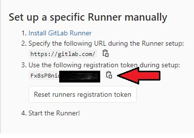

# Setup Custom Runner Agent on Windows & Linux

## Windows

### Download Runner Agent
- GoTo Workstation
- Create Folder in Documents Folder _Gitlab-Runner_
- Click here to [Download Runner Agent](https://gitlab-runner-downloads.s3.amazonaws.com/latest/binaries/gitlab-runner-windows-amd64.exe)
- Copy GitlabRunner agent exe in Documents _Gitlab-Runner Folder_
- Open _**Command Prompt** as administrator_
- Navigate to Documents > Gitlab-Runner folder
  

### Register Runner Agent

- Run commands in Terminal
    
- `gitlab-runner.exe register`
- Enter Url when asked `https://gitlab.com`
- Enter Token Value copied from previous step
- Description Add `_my-runner-agent_`
- Tags : `iis,windows,production`
- Enter `powershell`


### Install & Start Runner

- ENter following commands in Terminal
  -  `gitab-runner.exe install`
  -  `gitlab-runner.exe start`
    
  


## Linux

- Open Terminal
- Run Download Package

  ```bash
  sudo curl -L --output /usr/local/bin/gitlab-runner https://gitlab-runner-downloads.s3.amazonaws.com/latest/binaries/gitlab-runner-linux-amd64

  ```
- Install Package

  ```bash
  sudo chmod +x /usr/local/bin/gitlab-runner
  ```

- Create User
  ```bash
  sudo useradd --comment 'GitLab Runner' --create-home gitlab-runner --shell /bin/bash
  ```

- Install & Run
  ```bash
  > sudo gitlab-runner install --user=gitlab-runner --working-directory=/home/gitlab-runner
  
  > sudo gitlab-runner start
  ```

- Register Runner
  ```bash
  >> sudo gitlab-runner register
  ```
- Please enter the gitlab-ci coordinator URL (e.g. https://gitlab.com )
    ```bash
    https://gitlab.com
    ```
- Goto GitLab Project > Settings > CI/CD > Runners
- Copy Token Value
  
    

- Go back to Terminal and enter token when asked _"Enter the token you obtained to register the Runner:"_
- Enter the tags associated with the Runner, you can change this later in GitLab’s UI
  ```bash
  linux,docker
  ```
- Enter the Runner executor:
  ```bash
  docker
  ```
- If you chose Docker as your executor, you’ll be asked for the default image to be used for projects that do not define one in `.gitlab-ci.yml`:
  ```bash
  alpine:latest
  ```
